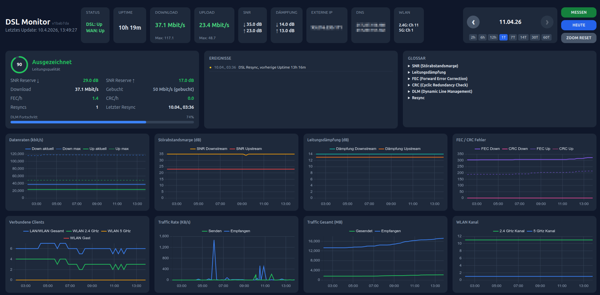

# DSL Monitor

Stündliches Monitoring der DSL-Leitungsparameter via TR-064 API. Web-Dashboard mit Verlaufscharts, Diagnostik-Panel und Leitungsqualitäts-Score. Deploybar als Docker-Container auf einem NAS.



## Unterstützte Hardware

- **AVM FRITZ!Box** (alle Modelle mit TR-064 Unterstützung, z.B. 7590, 7590 AX, 7530, 7490)

## Features

- **Automatische Erfassung** – konfigurierbares Intervall (Standard: 60 min), manuelle Messung per Klick
- **DSL-Monitoring** – Sync-Raten, SNR-Marge, Leitungsdämpfung, FEC/CRC-Fehler
- **Netzwerk-Monitoring** – verbundene Clients (LAN/WLAN), Traffic-Raten, Traffic gesamt, WLAN-Kanalwechsel
- **Status-Dashboard** – DSL-Kacheln (Status, Uptime, Raten, SNR, Dämpfung) + Netzwerk-Kacheln (WAN-Status, externe IP, DNS, WLAN-Info)
- **7 Verlaufscharts** im 2x2-Grid: Datenraten, SNR, Dämpfung, FEC/CRC, Clients, Traffic-Rate, Traffic gesamt, WLAN-Kanal
- **JSON-Speicherung** – täglich eine Datei, monatliche Aggregation (min/max/avg)
- **Docker/Podman** – ein Container, ein Volume, fertig

## Erfasste Werte (TR-064)

### DSL

| Metrik | Downstream | Upstream |
|--------|:----------:|:--------:|
| Aktuelle Sync-Rate (kbit/s) | ✓ | ✓ |
| Maximale Sync-Rate (kbit/s) | ✓ | ✓ |
| Störabstandsmarge / SNR (dB) | ✓ | ✓ |
| Leitungsdämpfung (dB) | ✓ | ✓ |
| Sendeleistung (dBm) | ✓ | ✓ |
| FEC-Fehler (korrigiert) | ✓ | ✓ |
| CRC-Fehler (nicht korrigiert) | ✓ | ✓ |

### Netzwerk

| Metrik | Beschreibung |
|--------|-------------|
| Hosts gesamt | Alle registrierten LAN/WLAN-Geräte |
| WLAN-Clients | Pro Band: 2.4 GHz, 5 GHz, Gast |
| Traffic-Rate | Aktuelle Sende-/Empfangsrate (Bytes/s) |
| Traffic gesamt | Kumuliert gesendet/empfangen (64-bit) |
| WAN-Status | Verbindungsstatus, externe IP |
| DNS-Server | Primär + Sekundär |
| WLAN-Info | SSID + Kanal pro Band |

## Schnellstart

```bash
# Repository klonen
git clone https://github.com/mamu7211/dsl-monitor.git
cd dsl-monitor

# Konfiguration anlegen
cp .env.example .env
# .env editieren: FRITZ_PASSWORD setzen

# Starten (mit Podman oder Docker)
./run.sh
# oder: podman compose up --build

# Browser öffnen
open http://localhost:8080
```

## Build & Deploy auf NAS

```bash
# Image bauen + als .tar exportieren
./build.sh

# .tar per scp aufs NAS laden + docker load
./deploy.sh

# Auf dem NAS: docker-compose.nas.yml anlegen (nicht im Repo, da NAS-spezifisch)
# und starten mit: docker compose -f docker-compose.nas.yml up -d
```

`deploy.sh` ist in der `.gitignore`, da NAS-spezifisch (Hostname + User anpassen).

Beispiel `docker-compose.nas.yml` für das NAS (mit optionalem Traefik Reverse-Proxy):

```yaml
services:
  dsl-monitor:
    image: ghcr.io/mamu7211/dsl-monitor:latest
    ports:
      - "8080:8080"
    volumes:
      - ./data:/app/data
    environment:
      - FRITZ_IP=${FRITZ_IP:-192.168.178.1}
      - FRITZ_USER=${FRITZ_USER}
      - FRITZ_PASSWORD=${FRITZ_PASSWORD}
      - POLL_INTERVAL_MINUTES=60
      - TZ=Europe/Berlin
    restart: unless-stopped
    # Optional: Traefik Reverse-Proxy
    # networks:
    #   - proxy
    # labels:
    #   - traefik.enable=true
    #   - traefik.http.routers.dsl-monitor.rule=Host(`dsl.example.lan`)
    #   - traefik.http.routers.dsl-monitor.entrypoints=websecure
    #   - traefik.http.routers.dsl-monitor.tls=true
    #   - traefik.http.services.dsl-monitor.loadbalancer.server.port=8080
# networks:
#   proxy:
#     external: true
```

## Konfiguration (.env)

```env
FRITZ_IP=192.168.178.1      # FritzBox IP-Adresse
FRITZ_USER=                  # Benutzername (leer = Standard-Admin)
FRITZ_PASSWORD=geheim        # FritzBox-Passwort
POLL_CRON=*/15 * * * *       # Cron-Ausdruck für Messintervall (default: alle 15 Min)
TARGET_DOWNSTREAM=50000      # Gebuchte Download-Rate in kbit/s (für DLM-Fortschritt)
TARGET_UPSTREAM=25000        # Gebuchte Upload-Rate in kbit/s
```

### Messintervall & Speicherverbrauch

| Intervall | Messungen/Tag | ~pro Tag | ~pro Monat | ~pro Jahr |
|-----------|:------------:|:--------:|:----------:|:---------:|
| 1 min     | 1.440        | 720 KB   | 21 MB      | 256 MB    |
| 5 min     | 288          | 144 KB   | 4,2 MB     | 51 MB     |
| 15 min    | 96           | 48 KB    | 1,4 MB     | 17 MB     |
| 60 min    | 24           | 12 KB    | 360 KB     | 4,3 MB    |

DSL-Werte ändern sich langsam (DLM-Anpassungen alle paar Stunden/Tage). Für Dauerbetrieb sind **15-60 Minuten** empfohlen. Kurze Intervalle (1-5 min) eignen sich gut zum Testen oder zur Fehlersuche nach einem Resync.

## API

| Methode | Pfad | Beschreibung |
|---------|------|-------------|
| GET | `/api/status` | Letzter Messwert |
| GET | `/api/readings/2026-04-09` | Alle Messwerte eines Tages |
| GET | `/api/readings?from=...&to=...` | Zeitraum (max. 90 Tage) |
| GET | `/api/summary/2026/4` | Monatszusammenfassung |
| POST | `/api/collect` | Sofort-Messung auslösen |
| GET | `/api/health` | Health-Check |

## Datenablage

```
data/
└── 2026/
    └── 04/
        ├── 2026-04-09.json   # Tageswerte (Array von Messungen)
        └── summary.json      # Monatsaggregation (min/max/avg)
```

## Tech Stack

- **Backend**: Python 3.12, FastAPI, fritzconnection, APScheduler, Pydantic
- **Frontend**: Vanilla JS, Tailwind CSS (CDN), Chart.js (CDN)
- **Container**: Docker/Podman Compose, python:3.12-slim Base-Image
- **Datenquelle**: FritzBox TR-064 API (SOAP/UPnP)

## Hintergrund

- **TR-064**: SOAP-basiertes Protokoll der FritzBox. `fritzconnection` abstrahiert die Aufrufe. Wichtig: SNR/Attenuation-Werte kommen als Zehntel-dB (z.B. 350 = 35.0 dB).
- **FEC vs CRC**: FEC = korrigierte Fehler (normal), CRC = nicht korrigierbare Fehler (kritisch). Steigende CRC-Rate deutet auf Leitungsprobleme.
- **DLM (Dynamic Line Management)**: Provider-seitige Steuerung des Leitungsprofils. Nach einem Reset startet die Leitung konservativ (hoher SNR-Puffer, niedrigere Rate) und wird über Tage/Wochen aggressiver hochgefahren, solange die Fehlerraten niedrig bleiben.

---

FRITZ!Box is a registered trademark of AVM GmbH. This project is not affiliated with or endorsed by AVM.
